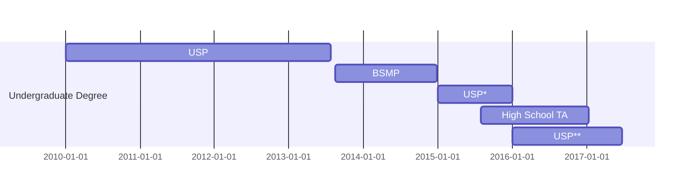
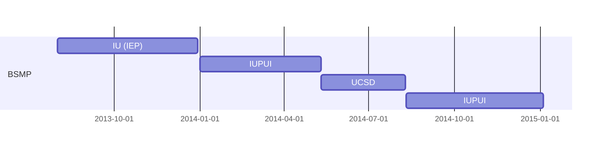

## Doctoral Degree

**[Cornell University](https://www.cornell.edu/) - [Department of Entomology](https://cals.cornell.edu/entomology)**
 - I am a PhD candidate in the Program of Entomology, working under the supervision of Dr. Patrick O'Grady.
 - I have served as a Graduate Teaching Assistant in five different courses (Model-Based Phylogenetics, Honey Bee Biology, Alien Empire, Insect Biology, and Plagues and People). 
 - Currently, I am serving as a Graduate Teaching Assistant for Investigative Biology in Fall 2024 and Spring 2025. 
 - Expected to graduate in May 2025.
 
**[Center for Teaching Innovation](https://teaching.cornell.edu/) - [Graduate Teaching Fellow](https://teaching.cornell.edu/cti-graduate-teaching-fellowship)**
 - I am currently serving as a Graduate Teaching Fellow for the third consecutive year. 
 - This year, I took the role of Senior Lead Graduate Teaching Fellow. In this position, I am leading the entire group of approximately 20 fellows as we prepare and present teaching workshops to the Cornell community. 

---

## Master's Degree

**USP: [Universidade de São Paulo](https://www5.usp.br/) - [Departamento de Genética e Biologia Evolutiva](https://posgenetica.ib.usp.br/#)**
 - I obtained my Master of Science in the Department of Genetics and Evolutionary Biology, working under the supervision of Dr. Carlos Vilela.
 - Graduation: August 2019.

**Volunteer Teacher in Adult Education**
 - I worked as a Volunteer Teacher in the Adult Education program of the Escola Nova Lourenço Castanho during my Master's Degree. 
 - I taught science classes for adults from underrepresented populations who did not have a chance to study when they were younger. For approximately two years I witnessed firsthand how education can impact and effectively change lives.
 - Fall 2017 - Spring 2019.
 
---

## Undergraduate Degree

**USP**: [Universidade de São Paulo](https://www5.usp.br/)
 - I attended the 6-year long program of Biological Sciences. 
 - This university has the highest academic entry requirements in my country, as well as the greatest reputation in Latin America, according to Times Higher Education. In addition, USP is consistently ranked as one of the top 5% of the world's leading research institutions.
 
**BSMP**: [Brazil Scientific Mobility Program](https://www.iie.org/programs/brazil-scientific-mobility/)
 - I was fortunate to receive this exchange program scholarship, which supported my studies in several American Universities, from August 2013 to December 2014.
 
**USP***: [Universidade de São Paulo](https://www5.usp.br/) - [Bachelor of Science](https://uspdigital.usp.br/jupiterweb/listarGradeCurricular?codcg=41&codcur=41012&codhab=204&tipo=N)
 - After returning to Brazil, I fulfilled the requirements of the Bachelor of Sciences degree.
 - I conducted independent research projects under the supervision of Dr. Carlos Vilela.
 - Graduation: April 2016.

**High School Teaching Assistant**
 - I started working as a High School Teaching Assistant of Biology at the Escola Nova Lourenço Castanho during my Bachelor of Science degree. 
 - The experience of closely following the students’ personal growth and intellectual development inspired me to pursue the Undergraduate Degree in Biology Education.
 - Fall 2015 - Fall 2017.

**USP****: [Universidade de São Paulo](https://www5.usp.br/) - [Biology Education (Licenciatura)](https://uspdigital.usp.br/jupiterweb/listarGradeCurricular?codcg=41&codcur=41012&codhab=304&tipo=N)
 - Subsequently, I fulfilled the requirements of the Undergraduate Degree in Biology Education (Licenciatura), where I studied theories of education while gaining practical teaching experience.
 - Graduation: September 2017.
 

## Brazil Scientific Mobility Program

**IU (IEP): [Indiana University, Bloomington](https://bloomington.iu.edu/index.html) - [Intensive English Program](https://dsls.indiana.edu/for-international-students/iep/index.html)**
 - I attended the two highest levels (6 and 7) of the program, which improved my English skills as I wanted to be prepared to continue my academic studies in American universities.
 - Fall 2013.
 
**IUPUI: [Indiana University-Purdue University-Indianapolis](https://indianapolis.iu.edu/)**
 - I attended Biology-related courses at the Purdue School of Science during two semesters.
 - Observation: The institution changed its name to Indiana University Indianapolis.
 - Spring and Fall 2014.

**UCSD: [University of California, San Diego](https://ucsd.edu/)**
 - Since the award also supported students who wished to develop their scientific skills abroad, I joined a research project at UCSD, working under the supervision of Dr. Maxi Richmond and Dr. Teri Markow.
 - Summer 2014.

---

